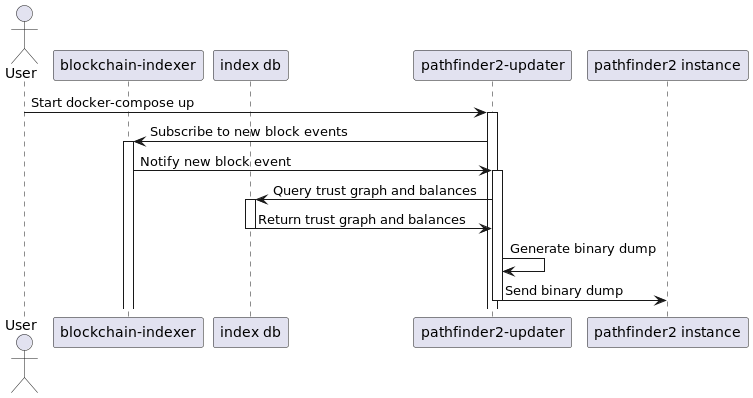

# pathfinder2-updater

The pathfinder2-updater is a service that queries the trust graph and balances from an index db and sends a binary
dump of that data to the pathfinder2 instance whenever a new block is indexed.



## Requirements

* To use the pathfinder with v1 events you need to have a
  running [blockchain-indexer](https://github.com/CirclesUBI/blockchain-indexer) instance with corresponding index db.
* To use the pathfinder with v2 events you need to have a Nethermind node
  with [circles-nethermind-plugin](https://github.com/CirclesUBI/circles-nethermind-plugin) installed and corresponding
  index db.

_In every case you need to have a [blockchain-indexer](https://github.com/CirclesUBI/blockchain-indexer) instance for
the updater to subscribe to new block events (its used merely as a trigger, the actual data is queried from the
indexer db). This is about to change in newer versions._

## Quickstart

The repository contains a docker-compose file that starts a pathfinder2 instance and the pathfinder2-updater.
It requires a connection string to a postgres db that contains the indexer data.

### Configure

Change the contents of the `.env` file in the root of the repository to your needs.
Also specify the version of the circles implementation you want to use.

```
# Which Cirlces version to use (v1 or v2)
CIRCLES_VERSION=v2

# The connection string to the blokchain-indexer db (v1) or the nethermind plugin db (v2)
INDEXER_DB_CONNECTION_STRING="Server=localhost;Port=5432;Database=postgres;User Id=postgres;Password=postgres;"

# The websocket url of the blokchain-indexer (v1). Used solely as trigger for the updater (on new block).
INDEXER_WS_URL=wss://rpc.helsinki.aboutcircles.com/indexer

# The path used by the updater to write the binary dump
INTERNAL_CAPACITY_GRAPH_PATH=/pathfinder-db/db.bin

# The path used by the pathfinder2 to read the binary dump (used in the load_safes_binary rpc call)
EXTERNAL_CAPACITY_GRAPH_PATH=/pathfinder-db/db.bin

# The url of the pathfinder2 instance
PATHFINDER_RPC_URL=http://localhost:8080
```

_Note: The internal and external paths are used to share the binary dump between the two services.
Each service can have the pathfinder-db volume mounted to a different location so its necessary to specify
the path used by the updater and the path used by the pathfinder2. In this example they are mounted to the same
locations._

### Start the environment

On first start, it pulls the pathfinder2 image and builds the pathfinder2-updater image.

```shell
docker-compose up
```
